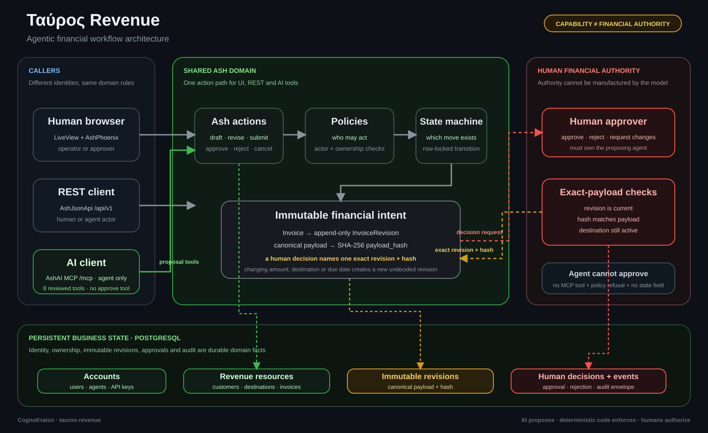

# Ταύρος Revenue

**Agentic financial workflow engineering with Elixir, Ash and AshAI.**

Tauros is an open-source, educational revenue application covering customers,
payment destinations, invoices and human approvals, and later payments and
reconciliation. AI agents do the operational work. Humans keep the authority.

> How can AI safely take part in financial workflows without the model being
> given financial authority?


## Where Tauros fits in CognoKratos

Tauros is **Part V — Agentic Financial Workflow Engineering** in the current
[CognoKratos curriculum](https://github.com/cognokratos/.github/blob/main/CURRICULUM.md).
It brings the earlier layers together inside a consequential domain: identity,
capability boundaries, deterministic policy, durable intent, human approval,
idempotency and audit all matter because the system is preparing financial
actions.

> **Core lesson:** AI capability is not financial authority.

This repository deliberately stops before settlement. Tauros knows financial
intent; Arktos currently knows how to protect cryptographic secrets and derive
public addresses. Secure signing, delegated cryptographic authority, payment
execution and reconciliation remain part of the open curriculum frontier.

The repository is a laboratory, not a finished financial platform. Read the
[CognoKratos foundation](https://github.com/cognokratos/.github/blob/main/FOUNDATION.md),
follow the structured synthesis in the [CognoKratos Book](https://book.cognokratos.com/part-5/introduction.html),
or help [challenge and extend the curriculum](https://github.com/cognokratos/.github/blob/main/CONTRIBUTING.md).

Tauros answers with architecture rather than prompts. Every interface (the
LiveView UI, the REST API and AI tools over MCP through AshAI) calls the
**same Ash actions**. The same **policies** and **state machines** decide what may
happen, whoever is asking. An agent with a valid API key can read, draft and
propose; it can't approve, issue, mark paid or change who owns what.

```text
AI proposes ─▶ the domain validates ─▶ a human reviews the exact payload ─▶ the human authorizes ─▶ (execution, later)
```

> An agent can prepare a financial proposal, pick only records it is allowed
> to use, explain its reasoning and submit it. A human sees the exact,
> immutable financial intent and approves it. The agent cannot obtain that
> approval itself, not through prompts, direct Ash calls, REST, manipulated
> state, retries or any other interface.

The repository proves this with tests, not claims. See
[what exactly stops an agent from approving](docs/AI-AUTHORITY.md#what-exactly-stops-an-agent-from-approving-an-invoice),
then try to break it with the [exercises](docs/EXERCISES.md).

## Two ways to use Tauros

| | |
| --- | --- |
| **Run it** as a reference architecture | `mix setup && mix phx.server`, sign in as `demo@tauros.local`, and decide on the proposals an agent left for you. Then drive the agent side yourself over [MCP](docs/MCP.md). |
| **Learn from it** as a course | **[Start the course →](docs/LEARNING-PATH.md)** 16 short lessons in four parts (identity, financial intent, human authority, AI capability). In each one you read a little code, run it, attack it, and find the guard that stopped you. |

| I want to… | Read |
| --- | --- |
| Understand why Tauros exists | [Vision](docs/VISION.md) · [AI capability is not authority](docs/AI-AUTHORITY.md) |
| See how it is built | [Architecture](docs/ARCHITECTURE.md) · [Domain model](docs/DOMAIN_MODEL.md) |
| Call the API | [REST API](docs/API.md) · [MCP for AI clients](docs/MCP.md) |
| Learn the concepts | [The course](docs/LEARNING-PATH.md) · [Labs](docs/EXERCISES.md) · [concepts/](docs/concepts) |
| Know what's next | [Roadmap](docs/ROADMAP.md) · [Workflows](docs/WORKFLOWS.md) |
| Contribute | [Development](docs/DEVELOPMENT.md) · [Security](docs/SECURITY.md) |

## Where it fits in the current curriculum

[CognoKratos](https://github.com/cognokratos) projects teach complementary
layers of trustworthy autonomous systems:

| Project | Teaches |
| --- | --- |
| [simple-agent-template](https://github.com/cognokratos/simple-agent-template) | production agent engineering: trust boundaries, MCP, guardrails, evaluation, identity and controlled mutation |
| [sophos-agent](https://github.com/cognokratos/sophos-agent) | durable agent runtime engineering: state, checkpoints, recovery, replay and idempotency |
| [etf-research-agent](https://github.com/cognokratos/etf-research-agent) | governed decision engineering: policy-as-data, evidence, decision authority and audit |
| [arktos-wallet](https://github.com/cognokratos/arktos-wallet) | cryptographic capability engineering: custody, key isolation, public derivation and least-capability tool design; no signing today |
| **tauros-revenue** | **agentic financial workflows**: domain modelling, policies, human authority, state machines, idempotency, audit and future reconciliation |

The Rust projects show how low-level infrastructure and protocols work.
Tauros shows how **Elixir and Ash compose sophisticated business and agentic
applications with very little handwritten infrastructure**.

**Tauros knows financial intent; Arktos protects cryptographic capability.** Tauros
stores public addresses only, and never holds or uses a key. Arktos currently
derives addresses but does not sign or broadcast transactions.

## Why Elixir and Ash

Ash describes the business as **declarations**: resources, actions, policies,
validations, changes and calculations. The framework enforces them identically
for every caller. The same declarations generate the JSON:API and its OpenAPI
spec, the LiveView forms, the database migrations and, with AshAI, the agent
tools. Ash extensions map one-to-one onto what Tauros teaches: AshStateMachine
for lifecycles, AshPaperTrail for audit, AshOban for durable execution and
AshAuthentication for identity.

Most of this repository was produced by generators (`mix igniter.new`,
`mix ash.gen.*`, `mix ash_authentication.add_strategy`,
`mix ash_phoenix.gen.live`, `mix ash.codegen`). That keeps the conventions
canonical and the handwritten parts easy to spot. The handwritten domain logic
is a few hundred lines of DSL.

## Architecture



The architecture is intentionally asymmetric: **AI capability stops at proposal,
while financial authority remains human and is enforced by deterministic domain
rules**. LiveView, REST and MCP all converge on the same Ash actions, policies,
validations and state machines. A human approval names one exact immutable
revision and its payload hash, never a mutable invoice in the abstract.

- **Humans** sign in with a password (Argon2id) or a magic link, or get a bearer
  token from the API. Registration is closed: approvers invite humans. An
  **operator** manages agents and customers; an **approver** also decides.
- **Agents** are AI or service principals. They authenticate with a generated API
  key (shown once, stored hashed, rotatable) and act only within their policies.
  Over MCP an AI client is offered eight reviewed tools to read its records and
  draft, revise, submit or withdraw invoices; there is no approval tool, and the
  policies would refuse one anyway.
- **Ownership** (human → agent → customer, destination, invoice) is enforced by
  Ash policies, including on creates, and cannot be reassigned.
- **Financial intent is immutable.** An invoice's content lives in revisions
  that are never edited; each is sealed with a SHA-256 of its canonical
  payload, and a human approval names one revision and its hash.

For the detailed layer-by-layer reference, see [Architecture](docs/ARCHITECTURE.md).
For the authority model and adversarial reasoning, see
[AI capability is not financial authority](docs/AI-AUTHORITY.md).

## Status

| | Capability | State |
| --- | --- | --- |
| Epic 1 | Human authentication; agents with generated API keys; customers owned through agents | ✅ rebuilt on Ash |
| Epic 2 | Agents register payment destinations; humans review them | ✅ rebuilt on Ash |
| Learning phase | Currency ≠ network ≠ rail; IBAN and Taproot checksums; destination lifecycle | ✅ |
| Epic 3 | Approver role and closed registration; idempotent invoice drafts; immutable revisions with payload hashes; AshStateMachine lifecycle; exact-payload approvals; the approval inbox; audit envelope; authority classification and adversarial tests | ✅ |
| Epic 4 | AshAI MCP endpoint for agents; eight reviewed read and proposal tools; exact allowlist test; MCP attack and prompt-injection tests | ✅ |
| Epics 5–9 | Audit, payments and reconciliation, data protection, semantic search, optional Arktos adapter | planned |

The original Phoenix-contexts implementation of Epics 1–2 is in the git history.
The behaviour was preserved; some API contracts were changed on purpose (see
[API.md](docs/API.md#changes-from-the-pre-ash-api)).

## Run it

You need the Erlang/Elixir versions in `.tool-versions` and PostgreSQL at
`localhost:5432` (user and password `postgres`):

```bash
docker run -d --name tauros-postgres -e POSTGRES_PASSWORD=postgres -p 5432:5432 postgres:17-alpine

mix setup        # deps, database, assets, demo seeds (a demo approver, an agent key, two proposals)
mix phx.server   # http://localhost:4000 · API docs at /api/swaggerui
```

## Test it

```bash
mix test         # domain policies, lifecycles, authority, attacks, API contract and LiveView flows
mix precommit    # warnings-as-errors, format, credo, sobelow, tests
```

CI also runs dependency audits and checks that migrations match the resources
(`mix ash.codegen --check`).

## Contribute to the curriculum

Tauros should evolve through real engineering experience. Particularly useful
contributions include adversarial authority tests, stronger audit models,
settlement/reconciliation experiments, alternative approval semantics,
concurrency failures, and proposals for how financial intent should cross into
a separate signing or settlement boundary.

A new contribution does not have to preserve the current design. If you can
show that an assumption fails, that evidence is itself valuable curriculum.
See the CognoKratos [contribution model](https://github.com/cognokratos/.github/blob/main/CONTRIBUTING.md).

## What comes next

Epic 5 turns the audit envelope into full, database-enforced history (AshPaperTrail);
Epic 6 issues approved invoices and reconciles payments. See the
[roadmap](docs/ROADMAP.md).

---

Tauros is an educational blueprint, not financial, legal or compliance advice.
It is part of [CognoKratos](https://github.com/cognokratos), an open-source,
community-built engineering curriculum supported by [BelaZayka](https://www.belazayka.com).

**License.** Original code and documentation are released under the
[MIT License](LICENSE). Vendored third-party assets and the brand images are
listed with their terms in [THIRD_PARTY_NOTICES.md](THIRD_PARTY_NOTICES.md).
