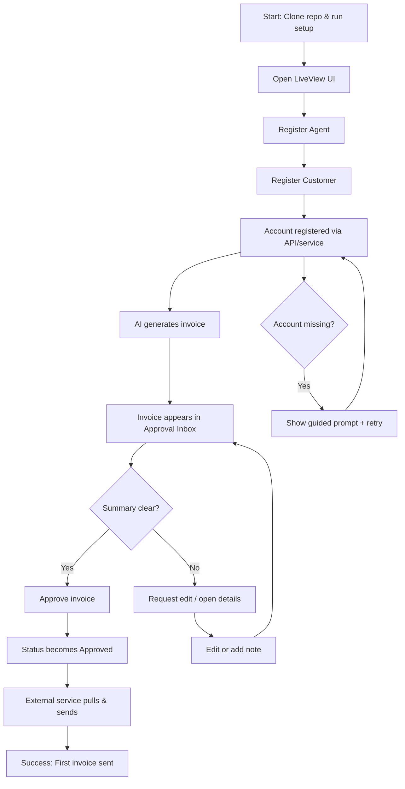
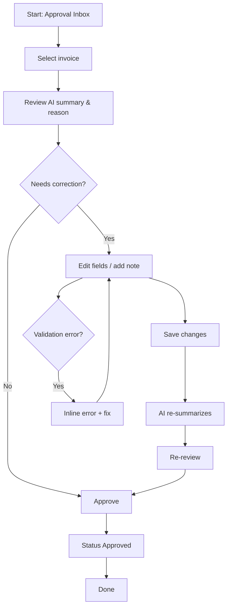
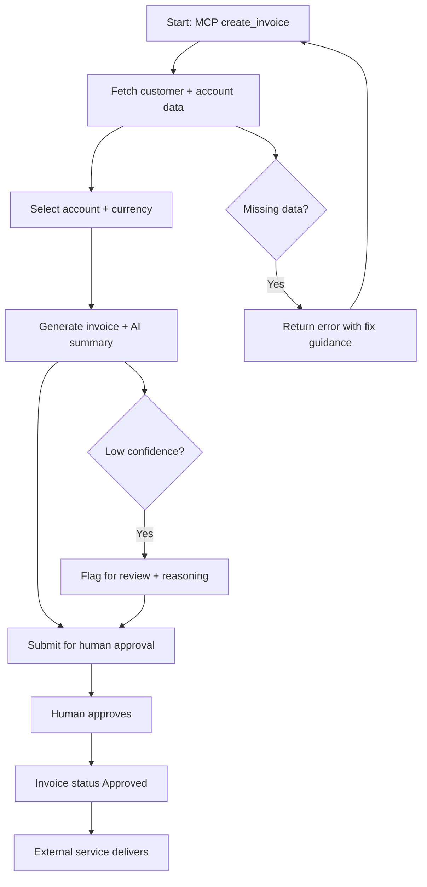

---
stepsCompleted:
  - 1
  - 2
  - 3
  - 4
  - 5
  - 6
  - 7
  - 8
  - 9
  - 10
  - 11
  - 12
  - 13
  - 14
inputDocuments:
  - /Users/victornitu/Projects/CognoKratos/tauros-revenue/_bmad-output/planning-artifacts/product-brief.md
  - /Users/victornitu/Projects/CognoKratos/tauros-revenue/_bmad-output/planning-artifacts/prd.md
  - /Users/victornitu/Projects/CognoKratos/tauros-revenue/_bmad-output/project-context.md
  - /Users/victornitu/Projects/CognoKratos/tauros-revenue/docs/index.md
  - /Users/victornitu/Projects/CognoKratos/tauros-revenue/docs/project-overview.md
  - /Users/victornitu/Projects/CognoKratos/tauros-revenue/docs/architecture.md
  - /Users/victornitu/Projects/CognoKratos/tauros-revenue/docs/api-contracts-web.md
  - /Users/victornitu/Projects/CognoKratos/tauros-revenue/docs/component-inventory.md
  - /Users/victornitu/Projects/CognoKratos/tauros-revenue/docs/data-models-web.md
  - /Users/victornitu/Projects/CognoKratos/tauros-revenue/docs/development-guide.md
  - /Users/victornitu/Projects/CognoKratos/tauros-revenue/docs/source-tree-analysis.md
  - /Users/victornitu/Projects/CognoKratos/tauros-revenue/docs/project-scan-report.json
author: Victor
date: 2026-01-16 16:06:49 CET
project_name: tauros-revenue
lastStep: 14
---

# UX Design Specification tauros-revenue

**Author:** Victor
**Date:** 2026-01-16 16:06:49 CET

---

<!-- UX design content will be appended sequentially through collaborative workflow steps -->

## Executive Summary

### Project Vision

Tauros Revenue is a teachable Phoenix/LiveView blueprint for blockchain-friendly invoicing where AI does the heavy lifting and humans validate with a single click. The product exists to remove crypto complexity and manual busywork while preserving trust through auditability and human oversight. It delivers the same workflow across LiveView UI, REST API, and MCP so founders can learn, copy, and extend a consistent pattern.

### Target Users

Primary users are tech-savvy solo founders and indie hackers who want speed, clarity, and automation without touching private keys. They are comfortable with APIs and developer tooling, and they work on the go—often on phones, tablets, and laptops from cafes, airports, or in transit. Secondary users are AI agents operating within strict guardrails, producing invoices and summaries for human approval.

### Key Design Challenges

- Making blockchain invoicing feel simple and safe, without exposing users to wallet mechanics or key management.
- Designing a single-click validation experience that feels trustworthy and auditable.
- Ensuring the UI is usable and clear across mobile, tablet, and desktop for users working in motion.

### Design Opportunities

- Create a “trust-first” approval flow where AI output is instantly legible, scannable, and easy to verify.
- Build a mobile-first review experience that lets founders approve or correct invoices in seconds.
- Use consistent visual language and summaries across UI/API/MCP to reinforce reliability and learning.

## Core User Experience

### Defining Experience

The core experience is simple and focused: AI generates invoices, and the human validates them in a single click with complete clarity. Everything else exists to support this moment—fast setup, clean summaries, and a trustworthy approval flow.

### Platform Strategy

Primary platform is web, optimized for touch-first use across phones, tablets, and laptops. Interactions should be lightweight, scannable, and tappable, with no offline requirements.

### Effortless Interactions

- Adding wallet accounts happens automatically once provided by services.
- Invoice generation and status updates are fully automated by AI and services.
- Human review is reduced to a clear, one-click validation with minimal friction.

### Critical Success Moments

- The “this is better” moment is when the user can approve an AI-generated invoice quickly while seeing a complete, trustworthy snapshot of what’s happening.
- The make-or-break flow is the approval experience; if it feels opaque or unsafe, trust collapses.

### Experience Principles

- Clarity over complexity: every approval view must explain itself in seconds.
- Human-in-control: AI does the work, humans give the final “yes.”
- Touch-first speed: every critical action should be easy on mobile.
- Automation by default: the system should move invoices forward without manual steps.

## Desired Emotional Response

### Primary Emotional Goals

- Calm, relaxed “zen” focus while handling invoices.
- Relief after completion, replacing stress with a sense of closure.

### Emotional Journey Mapping

- Discovery: “This feels simple and manageable.”
- During approval: calm confidence that everything is clear and under control.
- After completion: relief and satisfaction — “done, and done well.”
- When something goes wrong: reassurance and clarity, not panic.

### Micro-Emotions

- Trust over skepticism
- Calm over anxiety
- Confidence over confusion
- Relief over frustration
- Satisfaction over excitement

### Design Implications

- Calm → Reduce visual noise, emphasize clarity and whitespace.
- Trust → Transparent summaries and audit trails.
- Relief → One-click completion moments with clear confirmation.
- Confidence → Predictable, consistent flows with minimal branching.

### Emotional Design Principles

- Make the first step effortless to reduce initiation pain.
- Keep the UI minimal and quiet to support focus.
- Always show “what’s happening” in plain language.
- End every task with a clear, soothing sense of completion.

## UX Pattern Analysis & Inspiration

### Inspiring Products Analysis

- Apple Music: calm navigation, strong hierarchy, and “scan-first” layouts that keep complexity hidden until needed.
- Messaging apps: immediate clarity, lightweight actions, and fast-glance status cues.
- News/socials: rapid information access, bite‑sized summaries, and continuous awareness without heavy interaction.

### Transferable UX Patterns

- **Fast-scannable cards** with clear headings and compact metadata for invoice summaries.
- **Status chips/badges** for instant state recognition (Pending, Approved, Paid).
- **Single primary action** per screen (e.g., Approve) with minimal secondary clutter.
- **Progressive disclosure**: show essentials first, details on tap.
- **Feed-like “what’s new” view** for recent AI-generated invoices and updates.

### Anti-Patterns to Avoid

- Information overload or dense dashboards that increase anxiety.
- Multi-step approval flows that break the “one-click relief” moment.
- Visual noise (heavy charts, busy backgrounds) that fights the calm, zen goal.
- Deep, nested navigation that makes simple tasks feel complex.

### Design Inspiration Strategy

**What to Adopt:**
- Apple Music’s calm hierarchy and lightweight navigation to keep focus.
- Messaging-style clarity and immediacy for approval actions.

**What to Adapt:**
- News/social scanning patterns, tuned for trust and auditability (not doomscrolling).
- Feed layouts that surface key invoice events without endless distraction.

**What to Avoid:**
- Social noise and addictive engagement patterns.
- Dense finance dashboard tropes that feel heavy or intimidating.

## Design System Foundation

### 1.1 Design System Choice

Tailwind CSS with a custom component system (no external component libraries).

### Rationale for Selection

- Aligns with the existing Phoenix/LiveView + Tailwind stack.
- Enables a calm, zen visual language without UI-library defaults.
- Supports fast iteration while keeping a unique, product-specific identity.

### Implementation Approach

- Build a lightweight component library using Tailwind utility patterns.
- Establish design tokens (color, type scale, spacing, radius, shadows).
- Create reusable patterns for cards, status chips, summary blocks, and primary actions.

### Customization Strategy

- Define a serene color palette and muted surfaces to reduce stress.
- Use clear typographic hierarchy to make summaries scannable on mobile.
- Create one-click approval components with strong affordances and gentle feedback.

## 2. Core User Experience

### 2.1 Defining Experience

The defining experience is a calm, fast “approval inbox” where AI-generated invoices are ready for a single-tap validation. Users check in when they have 5 minutes, review a clear summary, and approve — everything else happens automatically.

### 2.2 User Mental Model

Users expect that invoicing should be automated: AI prepares invoices, selects accounts, and queues them for approval. Humans only step in to validate and ensure it makes sense. Trust depends on quickly understanding *why this customer is being invoiced* and what the AI decided.

### 2.3 Success Criteria

- Approval happens in seconds with one primary action.
- The status changes immediately, confirming success.
- The user never needs to send or follow up — external services handle delivery.
- The AI summary answers the “why this invoice exists” question.

### 2.4 Novel UX Patterns

The experience combines established patterns (approval inbox, single-action confirm) with a lightweight AI summary layer. No novel interaction is required — the innovation is clarity and speed within a familiar approval flow.

### 2.5 Experience Mechanics

**Initiation:**  
User opens an “Invoices to Validate” feed when they have a short window (5 minutes).

**Interaction:**  
Each invoice shows a concise AI summary and the reason for billing; the user taps a single “Approve” button.

**Feedback:**  
Immediate status change to “Approved” with calm confirmation.

**Completion:**  
No further user action; external services pull approved invoices and send to customers.

## Visual Design Foundation

### Color System

**Theme:** Mist & Slate with blue accent  
- Base surfaces: soft mist-gray backgrounds with subtle contrast  
- Text: deep slate for strong readability  
- Accent: calm blue for primary actions and status emphasis  
- Semantic colors: success (muted green), warning (amber), error (soft red)

### Typography System

- Tone: modern, minimal, highly legible  
- Primary type: clean sans-serif (system-safe or open-source equivalent)  
- Hierarchy: strong contrast between headings and body for fast scanning  
- Body size optimized for mobile readability

### Spacing & Layout Foundation

- Layout: compact and efficient, but not crowded  
- Base spacing unit: 8px grid with tight vertical rhythm  
- Cards: dense summaries with clear separation lines  
- Primary actions: always visible, fixed placement on mobile

### Accessibility Considerations

- WCAG AA contrast for text and buttons  
- Touch targets ≥ 44px for primary actions  
- Clear focus states and visible status changes

## Design Direction Decision

### Design Directions Explored

Six directions explored: Quiet Ledger, Calm Feed, Focus Panel, Split Review, Compact List, and Zen Flow. Variations covered feed-based review, split-pane reasoning, single-task focus, and step-by-step validation.

### Chosen Direction

**01 Quiet Ledger** — minimal cards with a focused explanation pane for “why this invoice exists.”

### Design Rationale

- Aligns with the calm/zen goal through restrained layout and clear hierarchy.
- Supports the “approval inbox” mental model with quick scan + deep clarity.
- Keeps the approval moment centered, with AI reasoning always visible.

### Implementation Approach

- Primary layout: left list of pending invoices + right explanation pane.
- Each list item includes amount, customer, status chip, and AI summary.
- Approval action remains fixed and prominent within the explanation pane.

## User Journey Flows

### 1) Alex — Fresh Clone → First Invoice

**Goal:** Reach a first approved invoice with minimal setup friction.

### 2) Alex — First Correction (Edge Case)

**Goal:** Correct an AI-generated invoice without breaking trust.

### 3) AI Agent — Invoice Creation with Guardrails

**Goal:** Create invoice safely, route it, and hand off for human approval.

### Journey Patterns

- **Approval Inbox Pattern:** list of pending invoices + focused reasoning pane.
- **Single Primary Action:** one-click approve with calm confirmation.
- **Progressive Disclosure:** essential info first, details on demand.
- **Guardrail Loop:** AI must pause for human validation before delivery.

### Flow Optimization Principles

- Minimize steps to approval.
- Make “why this invoice exists” visible before any action.
- Provide immediate status feedback after approval.
- Keep error recovery inline and calm.

## Component Strategy

### Design System Components

Tailwind-based foundation components:
- Buttons (primary, secondary, ghost)
- Inputs (text, select, search)
- Badges/chips (status)
- Cards/panels
- Tabs/segmented controls
- Toasts/alerts
- Modal/drawer

### Custom Components

### Approval Inbox List
**Purpose:** display pending invoices with key metadata and status.  
**Usage:** primary list view in Quiet Ledger layout.  
**Anatomy:** customer, amount, currency, due date, status chip, AI summary tag.  
**States:** default, selected, loading, empty.  
**Variants:** compact / standard.  
**Accessibility:** list roles, focus rings, keyboard selection.  
**Interaction Behavior:** selection updates reasoning pane.

### Reasoning Pane
**Purpose:** explain “why this invoice exists” with AI summary + routing.  
**Usage:** fixed right pane in Quiet Ledger.  
**Anatomy:** summary header, reasoning block, routing metadata, actions.  
**States:** default, low-confidence warning, error.  
**Accessibility:** headings, status regions, action focus order.  
**Interaction Behavior:** approve / request edit actions.

### Invoice Summary Card
**Purpose:** compact invoice snapshot for quick scan.  
**Usage:** list items, feed tiles, or mobile stack.  
**States:** pending, needs review, approved.  
**Variants:** small (mobile), regular (desktop).  
**Accessibility:** status text + color.

### Confidence Banner
**Purpose:** flag low-confidence AI decisions.  
**Usage:** above reasoning pane or within card.  
**States:** warning, critical, dismissed.  
**Accessibility:** role=alert when critical.

### Approval Footer Bar (Mobile)
**Purpose:** fixed approval actions on small screens.  
**Usage:** mobile view of reasoning pane.  
**States:** enabled, disabled, loading.  
**Accessibility:** large touch targets.

### Audit Trail Timeline
**Purpose:** immutable history of invoice events.  
**Usage:** expandable section in invoice detail.  
**States:** default, empty.  
**Accessibility:** chronological list semantics.

### Component Implementation Strategy

- Build custom components using shared tokens (color, spacing, type).
- Keep interaction patterns consistent across list + pane.
- Prioritize mobile touch targets and clear focus states.

### Implementation Roadmap

**Phase 1 (Core):**
- Approval Inbox List
- Reasoning Pane
- Approval Footer Bar (Mobile)

**Phase 2 (Support):**
- Invoice Summary Card
- Confidence Banner

**Phase 3 (Enhancement):**
- Audit Trail Timeline

## UX Consistency Patterns

### Button Hierarchy

**When to Use:** approvals, edits, and navigation actions.  
**Visual Design:** primary = blue solid; secondary = white with border; ghost = text-only.  
**Behavior:** one primary action per view; disable until required data is present.  
**Accessibility:** clear focus ring; labels reflect action (“Approve Invoice”).  
**Mobile Considerations:** primary action fixed in footer bar on small screens.

### Feedback Patterns

**When to Use:** status changes, errors, warnings, success confirmations.  
**Visual Design:** subtle banners and toasts with calm tone.  
**Behavior:** instant status change + confirmation; errors are inline and actionable.  
**Accessibility:** role=alert for critical warnings.  
**Mobile Considerations:** toast anchored near action area.

### Form Patterns

**When to Use:** edits, agent/customer/account creation.  
**Visual Design:** single-column, compact; labels always visible.  
**Behavior:** inline validation; disable submit on errors.  
**Accessibility:** proper labels, error association, keyboard support.  
**Mobile Considerations:** large touch targets and clear focus.

### Navigation Patterns

**When to Use:** switching between inbox, accounts, customers.  
**Visual Design:** minimal top nav + section tabs; avoid deep nesting.  
**Behavior:** preserve context; keep approval inbox as default landing.  
**Accessibility:** clear active states and skip-to-content support.  
**Mobile Considerations:** tabs collapse into a bottom bar or segmented control.

### Additional Patterns

**Empty States:** calm, instructional copy + single CTA (“Connect an account”).  
**Loading States:** skeletons for lists; keep reason pane stable.  
**Search/Filter:** one-line search with quick chips (Pending, Needs Review).  
**Errors:** plain language; show “what happened” and “what to do next.”

## Responsive Design & Accessibility

### Responsive Strategy

- **Desktop:** keep Quiet Ledger split-pane (list + reasoning pane).
- **Tablet:** use split-pane in landscape; stack list → detail in portrait.
- **Mobile:** list → detail pattern with fixed approval footer bar.

### Breakpoint Strategy

- Standard breakpoints:  
  - Mobile: < 768px  
  - Tablet: 768–1023px  
  - Desktop: ≥ 1024px  
- Use layout switches based on available horizontal space.

### Accessibility Strategy

- WCAG AA baseline for contrast and interaction.
- Touch targets ≥ 44px.
- Clear focus states and keyboard navigation.
- Semantic structure for lists, headings, and status updates.

### Testing Strategy

- Prioritize mobile Chrome and desktop Chrome.
- Validate split-pane behavior on tablet landscape.
- Keyboard-only navigation test for all critical flows.

### Implementation Guidelines

- Mobile-first CSS with layout upgrades at breakpoints.
- Sticky approval footer on small screens.
- Consistent status text + iconography for clarity.
- Ensure errors and confirmations are screen-reader friendly.
