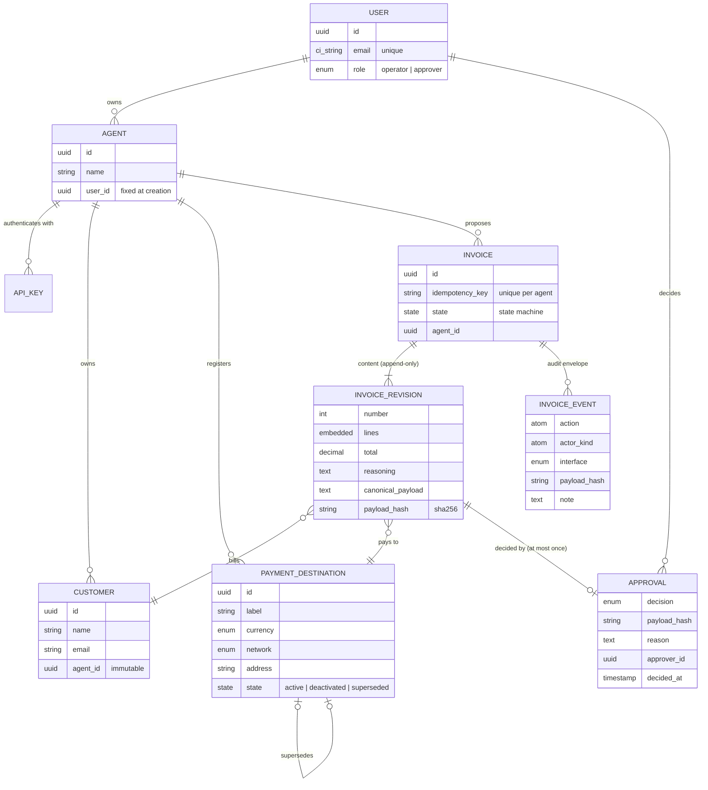
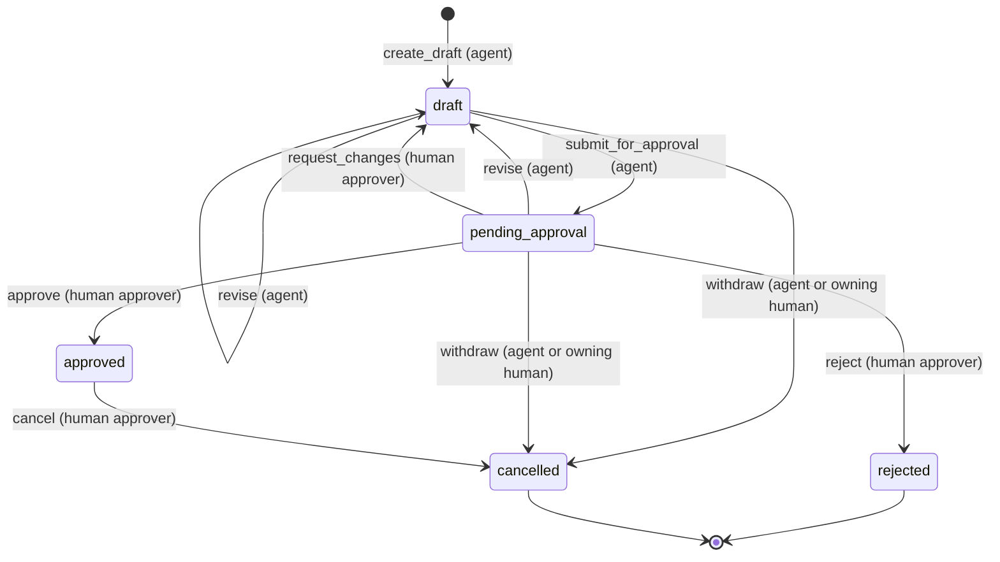

# Domain model

Tauros has two Ash domains. **Accounts** answers *who may act*. **Revenue**
holds *what the business is owed, where it gets paid, and who decided*. This
page describes what exists today. [ROADMAP.md](ROADMAP.md) covers what comes
next.



## Actors

Tauros has two kinds of actor, and every policy states which kind it means
(`Tauros.Accounts.Checks.HumanActor`, `HumanApprover` and `AgentActor`).

| Actor | Resource | Authenticates with | Holds |
| --- | --- | --- | --- |
| **Human operator** | `User`, `role: :operator` | password or magic link (UI); bearer token (API) | manages their agents and customers; reviews proposals and destinations; can withdraw drafts |
| **Human approver** | `User`, `role: :approver` | same | everything an operator holds, plus **authority**: approve, reject, request changes, cancel, invite humans |
| **Agent** | `Agent` | API key (`Authorization: Bearer tauros_…`) | **capability** only: read its records, register destinations, propose, revise, submit and withdraw invoices |

An agent is any non-human caller: an LLM agent, an MCP client, a reporting
job. Tauros does not care how the agent decides. It only cares which agent is
calling and what that agent may do.

## Accounts domain

### User

The human, generated by AshAuthentication (password with Argon2id, magic
link, email confirmation, tokens stored in `Token`).

- **Registration is closed.** Neither strategy registers anyone; there is no
  `/register`. A magic link signs in an existing human only.
- **`bootstrap_approver(email)`** designates the first approver. It is an
  email-keyed upsert, authorized only while no approver exists and never for
  an agent (`NoApproverYet`, `forbid_if AgentActor`). On a fresh install it
  creates the human; after upgrading from before roles existed it promotes an
  existing one. Run it once from a console or the seeds.
- **`invite(email, role)`** lets an approver bring in an operator or another
  approver. The invitee signs in with a magic link, or sets a password through
  "Forgot your password?".
- **`role`** (`Tauros.Accounts.Role`) is set by `invite` or `bootstrap_approver`.
  No update action accepts it.

Humans are still isolated from one another: each sees only their own agents
and everything below them. An approver decides on invoices of the agents
*they* own. Organizations (several humans sharing agents, separation of
duties between people) are deliberately out of scope; see
[SECURITY.md](SECURITY.md#known-gaps).

### Agent

- `name` is required, trimmed and at most 160 characters.
- `user_id` comes from the actor (`relate_actor(:user)`) and is never input.
- Creating an agent **issues an API key**, returned once in action metadata;
  only a SHA-256 hash is stored. `rotate_api_key` locks the row, revokes all
  keys and issues one.
- An agent cannot be destroyed while it owns customers, destinations or
  invoices (`ON DELETE RESTRICT`).

### ApiKey

Generated by `mix ash_authentication.add_strategy api_key`. Keys look like
`tauros_<random>_<checksum>` and are found by an indexed lookup. Nobody can
read them.

## Revenue domain

### Customer

A party Tauros bills. `name` and `email` can be corrected by the owning human;
`agent_id` is accepted only on create. Agents can **read** their own customers
(to address proposals to them) but cannot create or change them.

### Currency, network, rail: what a destination is made of

A currency does not decide how it is settled. Tauros separates three ideas:

| Concept | Module | Examples | Decides |
| --- | --- | --- | --- |
| **Currency** (asset) | `Tauros.Revenue.Currency` | `USDC`, `ETH`, `BTC`, `EUR`, `CHF` | what is owed; how many decimal places an amount may have |
| **Network** (or account scheme) | `Tauros.Revenue.Network` | `ethereum`, `arbitrum`, `base`, `bitcoin`, `iban` | which currencies can arrive there; which rail it belongs to |
| **Rail** | `Tauros.Revenue.Network.rail/1` | `evm`, `bitcoin`, `bank_transfer` | what a receiving address looks like (`Tauros.Revenue.Address`) |

```text
USDC  on ethereum  (evm rail)            to 0x…
USDC  on arbitrum  (evm rail)            to 0x…
ETH   on base      (evm rail)            to 0x…
BTC   on bitcoin   (bitcoin rail)        to bc1p…
CHF   on iban      (bank_transfer rail)  to CH…
```

`Network` declares which currencies each network carries (for example,
Arbitrum carries ETH, USDC, USDT and DAI). Only the network is stored on a
destination; the rail is derived from it.

A currency symbol is not a token contract: "USDC on Arbitrum" may mean native
USDC or bridged USDC.e. Tauros records financial intent and stops at the
symbol. A settlement adapter (Epic 6) must map symbol and network to a
contract.

### PaymentDestination

Where an agent is paid: a `label`, a `currency`, a `network` and a public
`address` on that network. It was called `WalletAccount` before this phase;
an IBAN is not a wallet, and the old name hid the network.

| Rule | How |
| --- | --- |
| The network must carry the currency | `Validations.Receivable` |
| The address must be valid for the network's rail | `Validations.Receivable` → `Tauros.Revenue.Address` |
| Registered by the agent, as itself | `relate_actor(:agent)`, `AgentActor` policy |
| Details never change | no action accepts `label`, `currency`, `network` or `address` after create |
| Can be retired, never deleted | AshStateMachine `state`: `active → deactivated`, `active → superseded` |
| A correction names what it replaces | `create` with `supersedes_id`; the old one becomes `superseded` in the same transaction |

**Address validation** is honest about what it checks:

| Rail | Checked | Not checked |
| --- | --- | --- |
| bitcoin | Taproot only (`bc1p`), **bech32m checksum** (BIP-350), 32-byte witness v1 program | other address types, testnets, spendability |
| evm | **format only**: `0x` + 40 hex | the EIP-55 checksum (needs Keccak-256, not in OTP's `:crypto`), contract vs account |
| bank_transfer | IBAN country code, length, **ISO 13616 mod-97 checksum** | country-specific BBAN structure, whether the account exists |

No check proves that anyone controls an address. That is why destinations are
shown to humans, and why approval re-checks that the destination is active.

**Lifecycle.** Only `active` destinations can be used by a new invoice
revision, submitted, or approved. A deactivated or superseded destination stays
readable, because past invoices refer to it. The agent or its owning human
may deactivate; nobody can call `supersede` directly.

### Invoice

The first financial aggregate. The invoice holds **identity and lifecycle**;
its financial content lives in immutable revisions.

| Field | Rule |
| --- | --- |
| `agent_id` | the proposing agent (`relate_actor(:agent)`); never input |
| `idempotency_key` | chosen by the agent, unique per agent |
| `state` | AshStateMachine; never input |
| `current_revision` | the latest revision (`has_one … from_many?`, sorted by number) |



The `transitions` block of `Tauros.Revenue.Invoice` is the only definition of
this graph. Every transition goes through `Tauros.Revenue.Changes.Transition`
(or `Invoice.Changes.Decide` for decisions), which locks the row and asks the
state machine about the **current** state, not the copy the caller loaded.
`issued`, `partially_paid` and `paid` arrive with Epic 6.

### InvoiceRevision

One immutable statement of financial intent.

| Field | Rule |
| --- | --- |
| `number` | 1, 2, 3… per invoice (unique index), assigned under the invoice lock |
| `customer_id` | one of the **invoice agent's** customers |
| `payment_destination_id` | one of the **invoice agent's** destinations, `active`, receiving `currency` |
| `currency` | must equal the destination's currency |
| `due_date` | not in the past |
| `lines` | 1 to 100 embedded `InvoiceLine`s: description, quantity (> 0, ≤ 10⁹), unit amount (≥ 0, ≤ 10¹⁵), Decimal, ≤ 18 decimal places |
| `total` | computed exactly, never accepted |
| `reasoning` | the agent's explanation (required) |
| `canonical_payload`, `payload_hash` | the sealed `FinancialPayload` and its SHA-256 |

Cross-resource rules (`Validations.UsableReferences`) load each referenced
record and compare its `agent_id` with the invoice's. **An unknown id and an id
belonging to someone else get the same error**, so a response never reveals
whether another agent's record exists.

Amounts must fit the currency (`Validations.AmountsFitCurrency`): `10.005 EUR`
is rejected, not rounded. All arithmetic runs in an exact decimal context that
traps rounding (`FinancialPayload.exactly/1`).

There is no update or destroy action, and the create action's policy only
allows writes through an Invoice action (`accessing_from(Invoice, :revisions)`).

### The financial payload

`Tauros.Revenue.FinancialPayload` defines what a human authorizes.

| Included | Why |
| --- | --- |
| `schema` (`tauros.invoice.v1`) | a future layout can never collide with an old hash |
| `customer_id` | who is billed |
| `currency` | what is owed |
| `lines[]` (description, quantity, unit amount), in order | what is billed |
| `total` | the amount authorized |
| `destination` (id, network, address) | where the money goes, spelled out |
| `due_date` | when it is owed |

| Excluded | Why |
| --- | --- |
| timestamps, revision number, invoice and revision ids | record metadata, not intent: the same intent proposed again hashes the same |
| agent reasoning | the explanation, not the intent; stored next to the revision |
| customer name and email | reference data a human may correct without changing who is billed |
| destination label | presentation |

Canonical form: JSON, keys sorted at every level, no whitespace; decimals
normalized (`1.50` = `1.5`), dates ISO 8601, text Unicode NFC, line order
kept. The hash is SHA-256 of those bytes, lowercase hex.

### Approval

A human decision about one exact revision: `decision` (`approved`,
`rejected`, `changes_requested`), `reason`, `approver_id`, `revision_id`,
`payload_hash`, `decided_at`.

- At most one decision per revision (unique index on `revision_id`). After
  "request changes" the agent must revise before resubmitting.
- Append-only: no update or destroy action.
- Created only by `Invoice.approve`, `reject` or `request_changes`, and only
  for a human approver who owns the proposing agent. Two independent policies
  say so: one on the Invoice action, one on Approval's create.

### InvoiceEvent: the audit envelope

One row per invoice command that changed something, written in the same
transaction: action, from and to state, actor id and kind, interface (`ui`,
`api`, `console`), revision and payload hash, the agent's reasoning or the
human's reason, and the idempotency key on create. Replays and failed commands
write nothing. No actor can create, change or delete events.

## Ownership and authority rules

All of these are Ash policies, so they apply to every interface.

| Resource | Agent | Operator (owner) | Approver (owner) |
| --- | --- | --- | --- |
| Agent | — | manage | manage |
| Customer | read own | manage | manage |
| PaymentDestination | register, read, deactivate own | read, deactivate | read, deactivate |
| Invoice | create draft, revise, submit, withdraw own; read own | read; withdraw | read; withdraw; **approve, reject, request changes, cancel** |
| InvoiceRevision, Approval, InvoiceEvent | read own invoices' | read | read |
| User | — | read self | read self; **invite** |

`Tauros.Authority` lists every business action as agent-safe, human-only or
internal, and `test/tauros/authority_test.exs` checks the policies against
that list.

What the old implementation did differently is recorded in
[ARCHITECTURE.md](ARCHITECTURE.md#decisions).
