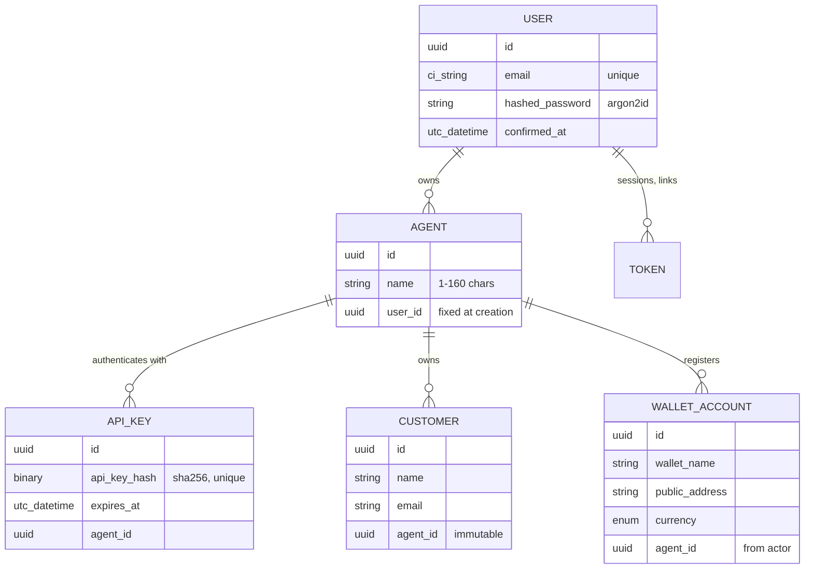

# Domain model

Tauros has two Ash domains. **Accounts** answers *who may act*. **Revenue**
holds *what the business is owed and where it gets paid*. This page lists what
exists today. [ROADMAP.md](ROADMAP.md) covers what comes next.

## Actors

Tauros has two kinds of actor, and every policy states which kind it is talking
about (`Tauros.Accounts.Checks.HumanActor` and `AgentActor`).

| Actor | Resource | Authenticates with | Holds |
| --- | --- | --- | --- |
| **Human** | `Tauros.Accounts.User` | Password or magic link (UI); bearer token from `POST /api/v1/users/sign-in` (API) | Authority. Owns agents and, through them, everything else. |
| **Agent** | `Tauros.Accounts.Agent` | API key (`Authorization: Bearer tauros_…`) | Capability. Acts for exactly one human, within what policies allow. |

An agent is any non-human caller: an LLM agent, an MCP client, a payment
listener, a reporting job. Tauros does not care how the agent decides; it only
cares which agent is calling and what that agent may do.

## Accounts domain

### User

The human. It is generated by AshAuthentication with password (Argon2id) and
magic-link strategies, email confirmation, and token storage in `Token`.

> There are no roles yet: every registered user is an independent "admin" who sees
> only their own data, and registration is open. See [SECURITY.md](SECURITY.md#known-gaps).

### Agent

- `name` is required, trimmed and at most 160 characters.
- `user_id` is set from the actor by `relate_actor(:user)` and is never accepted as input.
- Creating an agent **issues an API key**. The plaintext is returned once, in
  action metadata (`agent.__metadata__.api_key`); only a SHA-256 hash is stored.
- `rotate_api_key` revokes every existing key and issues a new one.
- Keys expire after 365 days (`valid_api_keys` filters on `expires_at > now()`).
- An agent cannot be destroyed while it owns customers or wallet accounts. The
  foreign keys use `ON DELETE RESTRICT`, and Ash reports "would leave records behind".

### ApiKey

This resource was generated by `mix ash_authentication.add_strategy api_key`.
Keys look like `tauros_<random>_<checksum>`; AshAuthentication finds them by an
embedded id and compares hashes, so a lookup is a single indexed query. There is
no read access for anyone: the only bypass is for AshAuthentication's own
sign-in interaction.

## Revenue domain

### Customer

A party Tauros bills.

| Field | Rules |
| --- | --- |
| `name` | required, trimmed, ≤ 160 |
| `email` | required, ≤ 160, must contain `@` and no spaces |
| `agent_id` | required on create; **no action accepts it afterwards** |

Ownership is immutable by construction: `update` accepts only `name` and
`email`, so a request that tries to move a customer to another agent is
rejected as invalid input. No check is needed for it.

### WalletAccount

A **public** receiving destination for payments. Tauros never sees keys, seeds
or signatures; custody belongs to a system like
[Arktos](https://github.com/cognokratos/arktos-wallet).

| Field | Rules |
| --- | --- |
| `wallet_name` | required, trimmed, ≤ 160 |
| `currency` | required, one of `Tauros.Revenue.Currency` |
| `public_address` | required, validated by the currency's settlement rail |
| `agent_id` | taken from the authenticated agent (`relate_actor(:agent)`) |

The settlement rail decides what a valid address looks like:

| Rail | Currencies | Address format |
| --- | --- | --- |
| Bitcoin | BTC | Taproot only: `bc1p` + 38–60 lowercase alphanumerics |
| Ethereum | ETH, USDT, USDC, DAI, TUSD, BUSD, FDUSD, GUSD, PAX, USDP, LUSD, FRAX, SUSD | `0x` + 40 hex characters |
| Bank transfer | USD, EUR, CHF, GBP, JPY, CAD, AUD, NZD, SEK, NOK, DKK, SGD | IBAN shape: 2 letters, 2 digits, 11–30 alphanumerics |

Wallet accounts are **append-only**: they have no update or destroy action. A
payment destination that silently changes is a classic fraud vector, so a
corrected destination is a new record.

## Ownership rules

These are all Ash policies, so they apply to every interface the same way.

| Resource | Create | Read | Update / destroy |
| --- | --- | --- | --- |
| Agent | any human; becomes the owner | the owning human | the owning human |
| Customer | a human, for an agent they own (checked after insert, inside the transaction) | humans, for customers of their agents | the owning human (destroy only; update cannot change ownership) |
| WalletAccount | the agent itself | owning human: all of their agents' accounts; agent: its own | nobody |

What the old implementation did differently, and why, is recorded in
[ARCHITECTURE.md](ARCHITECTURE.md#decisions).
