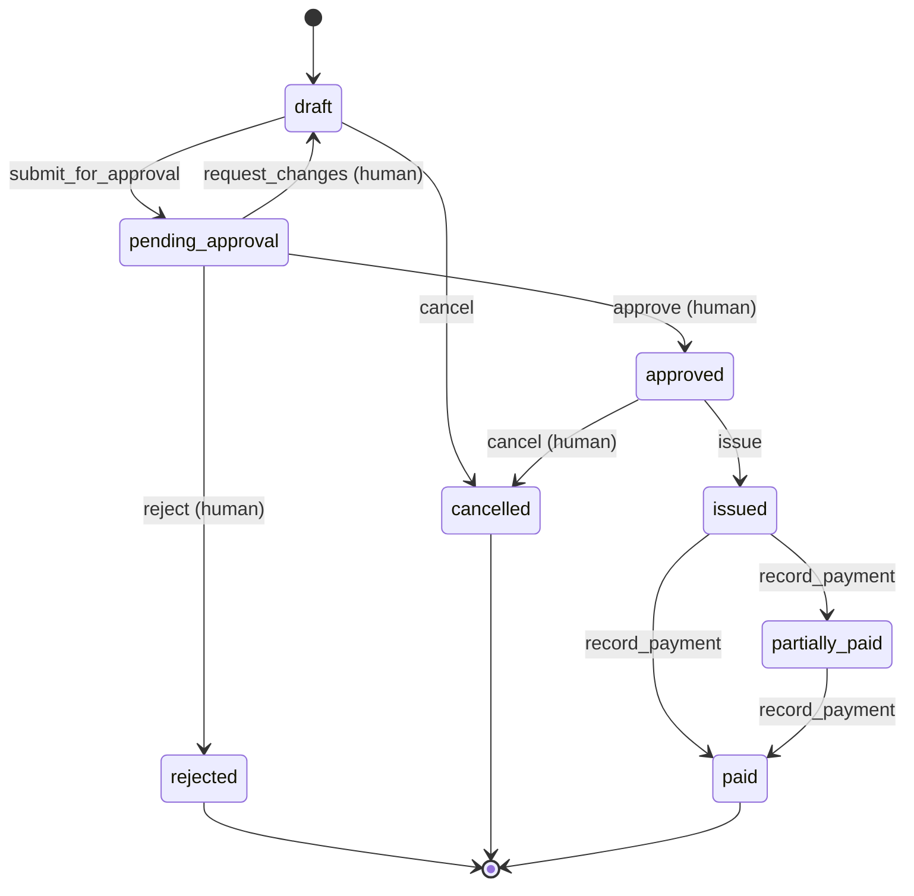

# Financial workflows are state machines, not conversations

> A financial workflow must not depend on an LLM remembering what happened
> previously.

A conversation is a lossy, unordered and replayable log of *intent*. A financial
record needs a single authoritative *state*, and a closed set of legal moves out
of that state. Tauros keeps the state in the database and the legal moves in the
resource definition, and the model is told only what the application reports.

## The planned invoice lifecycle



Every arrow is a named Ash action. With
[AshStateMachine](https://hexdocs.pm/ash_state_machine) the resource declares
the graph:

```elixir
state_machine do
  initial_states [:draft]
  default_initial_state :draft

  transitions do
    transition :submit_for_approval, from: :draft, to: :pending_approval
    transition :approve, from: :pending_approval, to: :approved
    transition :reject, from: :pending_approval, to: :rejected
    transition :issue, from: :approved, to: :issued
    transition :record_payment, from: [:issued, :partially_paid], to: [:partially_paid, :paid]
    transition :cancel, from: [:draft, :approved], to: :cancelled
  end
end
```

Policies can then talk about transitions, for example "only a `HumanActor` may
run `:approve`". AshStateMachine also provides a `possible_next_states`
calculation, which is exactly what a UI, or an AI tool description, needs to
show the legal options.

## Rules this implies

- **The model never sets `state`.** No action accepts `state` as input. Changing
  state *is* running a transition action, and the state machine rejects illegal
  ones whoever asks.
- **Derived states are calculations, not stored guesses.** `overdue` is
  `issued and due_date < today()`. It is an Ash calculation, not a status a
  service has to remember to set. (The old PRD listed *Overdue* as a status;
  that changes here.)
- **"Needs review" is a flag, not a state.** Low confidence or missing data
  attaches a reason to a `pending_approval` invoice. It does not add a branch to
  the graph.
- **Terminal states are terminal.** A paid, rejected or cancelled invoice is
  corrected with a new document (a credit note, a reissue), never by moving it
  backwards. History stays truthful.
- **Payment states count money; they don't trust messages.** `partially_paid`
  vs `paid` is decided by comparing reconciled payment amounts with the invoice
  total (Decimal or AshMoney, never floats). It is not decided by a "paid: true"
  field in a webhook. See [eventual consistency](eventual-consistency.md).
