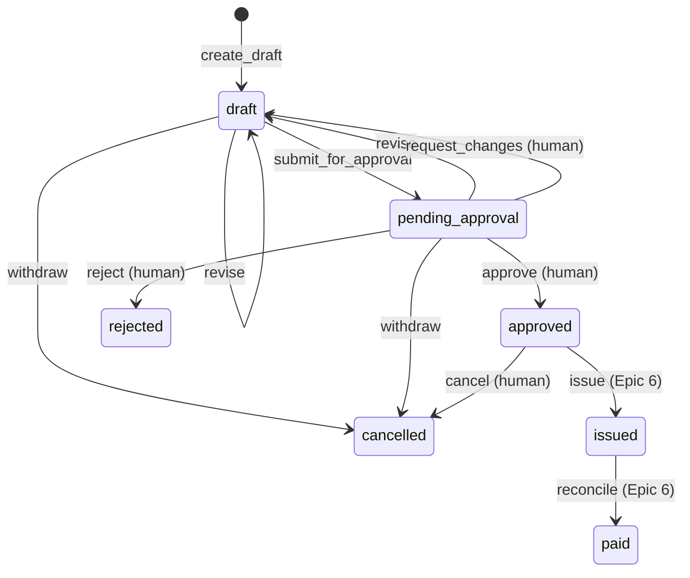

# Financial workflows are state machines, not conversations

> A financial workflow must not depend on an LLM remembering what happened
> previously.

A conversation is a lossy, unordered and replayable log of *intent*. A financial
record needs a single authoritative *state*, and a closed set of legal moves out
of that state. Tauros keeps the state in the database and the legal moves in the
resource definition. The model is told only what the application reports.

## The invoice lifecycle (implemented)



The resource declares it with [AshStateMachine](https://hexdocs.pm/ash_state_machine)
(`lib/tauros/revenue/invoice.ex`):

```elixir
state_machine do
  initial_states [:draft]
  default_initial_state :draft

  transitions do
    transition :revise, from: [:draft, :pending_approval], to: :draft
    transition :submit_for_approval, from: :draft, to: :pending_approval
    transition :withdraw, from: [:draft, :pending_approval], to: :cancelled
    transition :approve, from: :pending_approval, to: :approved
    transition :reject, from: :pending_approval, to: :rejected
    transition :request_changes, from: :pending_approval, to: :draft
    transition :cancel, from: :approved, to: :cancelled
  end
end
```

Payment destinations have a lifecycle too: `active → deactivated` and
`active → superseded`.

## Checking the transition against the current row

AshStateMachine's built-in `transition_state/1` change checks the state of the
struct the caller passed in. Two requests that loaded the same pending invoice
would both pass. So every Tauros transition goes through
`Tauros.Revenue.Changes.Transition` (or `Invoice.Changes.Decide`):

1. inside the action's transaction, `SELECT … FOR UPDATE` the row;
2. ask AshStateMachine (`AshStateMachine.transition_state/2`) whether the
   transition is legal from **that** state;
3. validations declared with `before_action?: true` then run on the locked row.

The graph above stays the single definition of what is legal. The lock only
makes sure the question is asked about the truth. `test/tauros/revenue/invoice_lifecycle_test.exs`
("the check uses the current row, not the caller's stale copy") shows the
difference.

## Rules this implies

- **Nobody sets `state`.** No action accepts it as input; a test enumerates
  every action to prove it. Changing state *is* running a transition action.
- **Who may run a transition is a policy, not part of the graph.** "Only a
  human approver may `:approve`" lives in the policies; the graph says only
  that `:approve` leaves `pending_approval`. Transitions that look similar
  but carry different authority are different actions: an agent may
  `withdraw` an undecided proposal, but only a human may `cancel` an approved
  invoice, so an agent acting on a stale copy can never cancel an approval.
- **Retries are not moves.** A retried submit or approval is detected and
  answered without writing (see [idempotency](idempotency.md)), so the graph
  needs no self-loops for them.
- **Terminal states are terminal.** A rejected or cancelled invoice is
  corrected with a new invoice, never by moving it backwards. History stays
  truthful.
- **Derived states are calculations.** `overdue` will be `issued and due_date <
  today()`, an Ash calculation, not a status a service must remember to set.
- **Payment states count money; they don't trust messages.** `paid` will be
  decided by reconciling payment amounts against the total (Decimal, never
  floats), not by a "paid: true" field in a webhook.

## Try it

[Exercise 2](../EXERCISES.md#2-skip-the-state-machine) tries to approve a draft.
